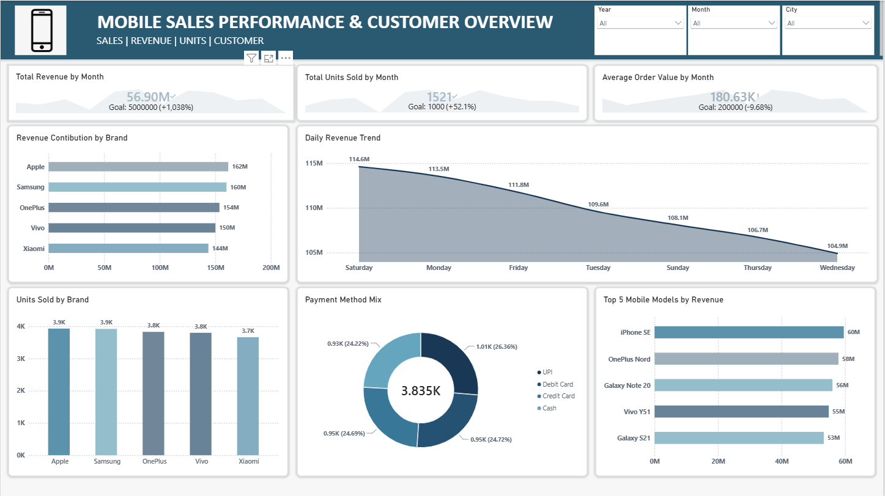

# 📱 Mobile Sales Performance Dashboard | Power BI

An interactive **Power BI dashboard** designed to analyze mobile sales performance across brands, mobile models, cities, payment methods, and time periods.

The dashboard transforms raw sales data into interactive business insights, helping identify **revenue trends, top-performing brands and models, customer behavior, and sales patterns**.

---

## 📊 Dashboard Preview



---

## 🎯 Project Objective

The objective of this project is to build a **business-oriented sales dashboard** that enables users to:

* Monitor overall sales performance
* Analyze revenue and units sold
* Compare performance across mobile brands and models
* Identify top-performing mobile models
* Analyze sales trends over time
* Understand customer payment preferences
* Compare sales performance across different cities
* Use interactive filters for detailed analysis

---

## 🛠️ Tools & Technologies

* **Power BI Desktop** – Dashboard development and visualization
* **Power Query** – Data cleaning and transformation
* **DAX** – Calculated measures and business logic
* **Data Modeling** – Structuring data for analysis
* **Microsoft Excel** – Source data preparation

---

## 📈 Key Dashboard Features

### 🔹 KPI Analysis

The dashboard provides key performance indicators to give a quick overview of sales performance:

* Total Revenue
* Total Units Sold
* Average Price
* Transaction Count

### 🔹 Brand Performance

Analyze sales performance across different mobile brands to identify:

* Leading brands
* Revenue contribution
* Units sold by brand

### 🔹 Mobile Model Analysis

Analyze individual mobile models to identify:

* Top-performing models
* Revenue contribution by model
* Units sold by model

### 🔹 Sales Trend Analysis

Interactive time-based visuals help analyze:

* Monthly sales trends
* Daily sales patterns
* Changes in sales performance over time

### 🔹 City-Wise Analysis

Analyze sales performance across different cities to identify geographical sales patterns and high-performing locations.

### 🔹 Payment Method Analysis

Understand customer payment preferences using a breakdown of payment methods such as:

* UPI
* Credit Card
* Debit Card
* Cash
* EMI

### 🔹 Customer Rating Analysis

Analyze customer ratings to understand overall customer satisfaction and identify rating patterns.

### 🔹 Interactive Filters

The dashboard includes interactive slicers that allow users to dynamically filter the analysis based on relevant dimensions such as:

* Month
* City
* Brand
* Mobile Model
* Payment Method

---

## 🧮 Data Analysis & DAX

The project demonstrates the use of DAX for creating calculated measures and deriving business metrics.

Example:

```DAX
Total Revenue =
SUMX(
    Sales_Data,
    Sales_Data[Units Sold] * Sales_Data[Price Per Unit]
)
```

Other analytical calculations include:

* Total Units Sold
* Transaction Count
* Average Price
* Brand-wise performance
* Model-wise performance
* Time-based sales analysis

---

## 📂 Repository Contents

```text
Mobile-Sales-Dashboard/
│
├── Mobile_sales_POWER_BI_Project.pbit
├── Mobile_Sales_Dashboard.png
└── README.md
```

### Files

**`Mobile_sales_POWER_BI_Project.pbit`**
Power BI Template containing the dashboard structure, visuals, queries, and report configuration.

**`Mobile_Sales_Dashboard.png`**
Preview image of the completed dashboard.

**`README.md`**
Project documentation.

---

## 💡 Business Insights

The dashboard can be used by sales teams and business analysts to:

* Identify high-performing mobile brands and models
* Monitor sales trends
* Understand customer purchasing preferences
* Identify cities contributing significantly to sales
* Compare payment method usage
* Track overall sales performance
* Support data-driven sales and inventory decisions

---

## 🚀 How to Use

1. Download the `.pbit` file from this repository.
2. Open it using **Power BI Desktop**.
3. Provide the required data source if prompted.
4. Load/refresh the data.
5. Explore the interactive dashboard using the available filters and visuals.

> **Note:** The project is provided as a `.pbit` Power BI Template rather than a `.pbix` file.

---

## 🎓 Skills Demonstrated

This project demonstrates practical experience in:

* Data Analysis
* Business Intelligence
* Power BI
* Power Query
* DAX
* Data Cleaning
* Data Modeling
* KPI Development
* Data Visualization
* Dashboard Design
* Business Insights

---

## 👨‍💻 Author

**Amartya Prasad**

Aspiring **Data Analyst | Data Science & AI/ML Enthusiast**

---

⭐ If you find this project useful, feel free to explore the repository and connect with me.
